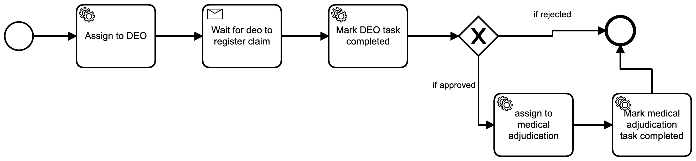

# claim-registration-ms

This application is generated using [LoopBack 4 CLI](https://loopback.io/doc/en/lb4/Command-line-interface.html) with the
[initial project layout](https://loopback.io/doc/en/lb4/Loopback-application-layout.html).

## Install dependencies

### Docker Compose

Docker compose is been provided which will start zeebe(core), monitor(UI) & claim_ms application. Run the following command.
```
docker-compose up
```

To stop and remove containers, run the following command.
```
docker-compose down
```

## Usage

Once docker-compose is UP. Zeebe monitor can be accessed via `http://localhost:8082/` and claim_ms swagger can be accessed via `http://localhost:3000/explorer`.

Postman collection files is also provided inside `libs` directory.

#### Create Workflow in Zeebe
```
http://localhost:3000/workflow
```
This api will deploy the workflow in zeebe. The sample workflow are kept in `workflow` directory. Currently it deploys `registrationWF.bpm`.


#### Create PreAuth Registration API
```
http://localhost:3000/registration
```
This api will trigger the pre-auth workflow for registration. Once this API is triggered an instance is created for the workflow and can be seen in the UI.

#### Register Claim API
```
http://localhost:3000/claim
``` 
This will be used to register claim details. Until this API is been called, the workflow instance will be paused. Once Claim is registered the instance will continue its execution. The workflow will continue its execution path based on the status been sent while registering.

